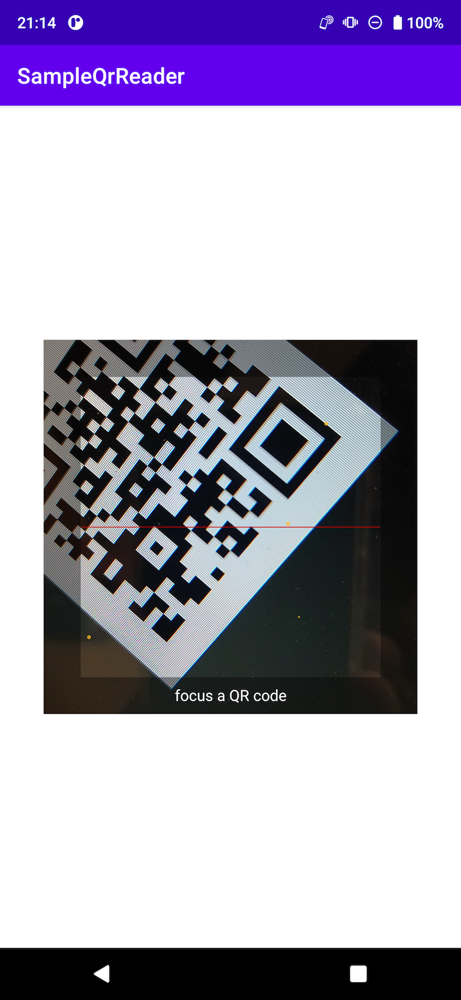
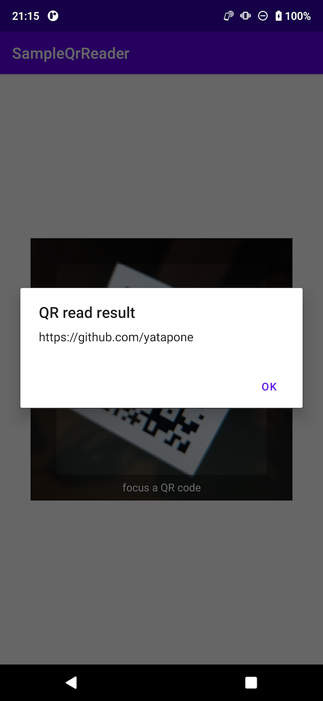

# SampleQrReader
This is an Android sample code for a QR code reader with zxing.

If JDK error happens, set your Android Studio to use Gradle JDK 11. 
[Preferences] > [Build, Execution, Deployment] > [Build Tools] > [Gradle]

&emsp;
&emsp;
